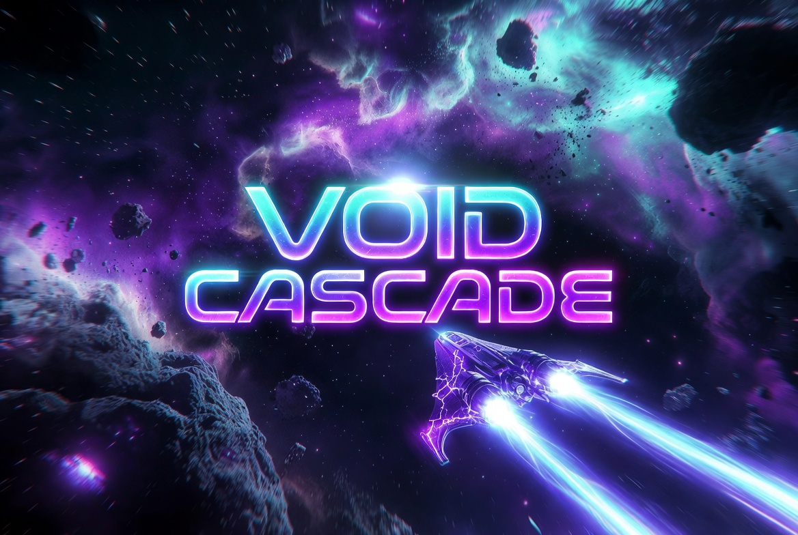

# VOID CASCADE



**Shatter the void. Master the cascade.**

A visually spectacular, skill-based arcade score chase in the Asteroids lineage.

Cinematic deep-space intensity mixed with pure arcade fun. Dark cosmic voids lit by neon energy, glowing asteroids, and explosive particle fireworks. Geometry Wars meets Asteroids meets high-end indie (Hyper Light Drifter / Downwell energy).

**Private prototype repository** — browser-first playable experience.

---

## Play Now (Browser)

Open `play/index.html` in a modern browser (Chrome / Firefox / Edge recommended).
Works straight off the filesystem, no build step and no server required.

Full keyboard + gamepad support. Touch-friendly controls planned.

**Rendering:** gameplay draws into an offscreen 2D canvas, which is then pushed
through a WebGL post-processing chain (`play/postfx.js`) for bloom, chromatic
aberration, vignette and tone mapping before hitting the screen. Zero external
dependencies. If WebGL is unavailable the game still runs, unprocessed.

The simulation is frame-rate independent, so it plays identically at 60, 120 and
144Hz.

---

## Core Gameplay (Preserved & Tightened)

- Ship rotation + thrust with authentic inertia
- High-velocity shooting
- Breakable asteroids that split into smaller, faster fragments
- Enemy fighters (**Rift Stalkers**)
- Stackable weapon power-ups (rapid / spread / pierce) that persist until you lose the ship
- Score multipliers, wave-clear bonus tallies, extra ships at score milestones, and a
  rescuable lost starfighter
- Power-ups, shields, and escalating difficulty
- Pure skill-based high-score chase
- Optional **Kid Mode** (easier difficulty, auto-shield assist, more frequent power-ups)

Multiplayer (coop/competitive) is secondary; single-player visual spectacle is priority for this prototype.

---

## Visual Style Guide (2026 Premium Indie)

### Art Direction
High-resolution **vector + particle hybrid**. Clean geometric silhouettes with heavy post-processing juice: bloom, trails, impact flashes, screen shake, subtle chromatic aberration (toggleable), optional CRT filter.

### Colour Palette
| Role              | Hex       | Notes |
|-------------------|-----------|-------|
| Void Black        | `#05010A` | Deep background |
| Nebula Purple     | `#1A0A2E` | Volumetric gas |
| Neon Cyan         | `#00F5FF` | Player energy, thrusters, UI |
| Electric Magenta  | `#FF00AA` | Accents, secondary glow |
| Plasma Blue       | `#3A7BFF` | Shields, secondary weapons |
| Hot White         | `#FFFFFF` | Cores, flashes |
| Ember Orange      | `#FF5E00` | Explosions, debris |
| Rock Grey         | `#4A4A5A` | Asteroid base |
| Cracked Energy    | `#00FFCC` | Asteroid fissures |

**Rule**: Everything important glows. Background is almost pure black with soft volumetric nebulae. Particles carry the emotional weight.

### Key Visual Elements
- **Background**: Multi-layer parallax starfield + animated soft nebula clouds (procedural or low-res sprites with heavy blur).
- **Ship**: Sleek angular interceptor with cyan energy trails, engine bloom, optional shield bubble.
- **Asteroids**: Rocky/metallic with glowing energy cracks. On death → dense particle burst + glowing shards that drift and fade.
- **Bullets**: Thin glowing energy bolts with short trail + subtle lens flare on impact.
- **Rift Stalkers**: Distinct aggressive silhouettes, red/magenta energy, different attack patterns (strafe, charge, spread).
- **Juice**: Every destruction has screen shake, flash, particle fireworks. Thrusters leave fading energy ribbons.

### Post-Processing (toggleable)
- Bloom / glow
- Subtle chromatic aberration
- Film grain / CRT scanlines (optional retro layer)
- Dynamic lighting on nearby objects

### UI
Minimal, high-contrast neon. Clean geometric buttons. High-score table with the new branding. Pause overlay with soft blur.

---

## Asset List (Mod-Friendly)

Designed so art/sound packs can be swapped in without touching game code.

### Required Art Pack Structure
```
assets/
  ships/
    player_default.png (or vector definitions)
    player_skins/
  asteroids/
    large/
    medium/
    small/
  enemies/
    rift_stalker_01.png
  powerups/
  ui/
    logo.png
    buttons/
  particles/   (or fully procedural)
  backgrounds/
    nebula_layers/
```

For this browser prototype all visuals are **procedural / canvas-drawn** so zero external assets needed. Future native builds can load sprite packs.

### Sound Design Direction
- Deep, resonant thruster hum with rising pitch on acceleration
- Sharp, crystalline laser shots
- Heavy, crunchy asteroid cracks + explosive bass hits
- Enemy engines: aggressive, distorted
- Power-up pickups: satisfying chime + rising arpeggio
- Music: pulsing synthwave / dark ambient with escalating intensity (or pure SFX for purity)

---

## Technical Stack (Prototype)

- Pure HTML5 + Canvas 2D + vanilla JS (no frameworks) for maximum browser compatibility and zero build step
- Gamepad API for controllers
- localStorage for high scores
- Designed to be easily ported to Godot 4 / SDL3 / Rust later while keeping the same gameplay core

Future: WebGL particle systems, full audio engine, mobile touch, multiplayer via WebRTC or dedicated server.

---

## Project Docs

| Doc | Purpose |
|---|---|
| [CLAUDE.md](CLAUDE.md) | Agent contract — operating loop, quality bar, verification policy |
| [STYLE_GUIDE.md](STYLE_GUIDE.md) | Visual and audio bible; source of truth for art decisions |
| [docs/PLAYTEST_CHECKLIST.md](docs/PLAYTEST_CHECKLIST.md) | The gate every gameplay change passes |
| [docs/INPUT_CONTROL_MAP.md](docs/INPUT_CONTROL_MAP.md) | Canonical control mapping |
| [docs/ASSET_PIPELINE.md](docs/ASSET_PIPELINE.md) | Asset layout, naming and loading rules |
| [assets/CREDITS.md](assets/CREDITS.md) | Source and licence for every asset |
| [TODO.md](TODO.md) | Working queue |
| [Session Logs/](Session%20Logs/_Session%20Logs%20Index.md) | Append-only session history |

---

## Credits & License

Loosely inspired by the classic Asteroids-style game *Maelstrom* (Ambrosia Software / Sam
Lantinga / libsdl-org) — no code, assets, or data from that project are used here.
Original Maelstrom 4.x is available under the Zlib license: https://github.com/libsdl-org/Maelstrom

All art direction, code, and assets are original work created for Void Cascade.

---

## Roadmap

1. ✅ Browser-playable single-player prototype with modern particle juice
2. Full visual polish + more enemy types + power-up variety
3. Mod system (swap visual/sound packs)
4. Native builds (SDL3 / Godot)
5. Optional local multiplayer
6. Steam / itch.io release packaging

---

**Make it look damn impressive.**  
Welcome to the Void Cascade.
